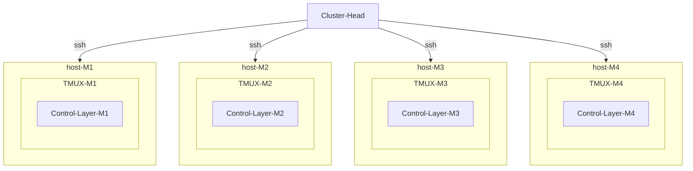

# Cluster Head

A `NodeRoll`is a collection of `Node` objects. Each node represents a device that is connected through SSH.

## `Node`

`node.exec(cmd)` : Execute single command and close shell on the node.

 `node.shell(cmd)` : Execute commands in a single interactive shell. This function is compatible with bash and python interactive terminal.

## Schematics

The 

## TODO

