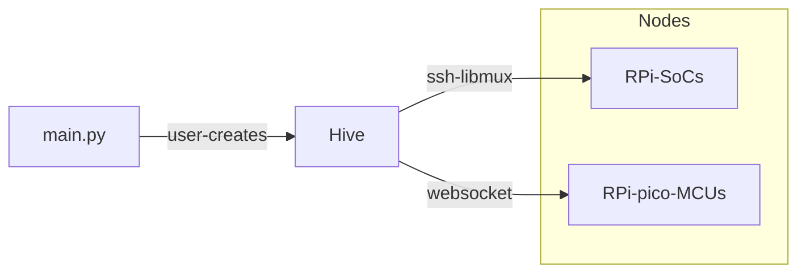
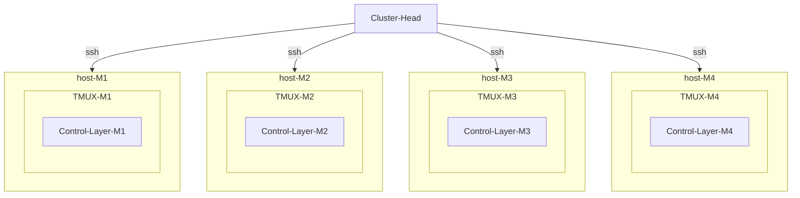
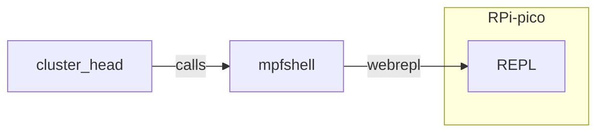

# Cluster Head

A `cluster-head`  is a terminal that is used to requisition a collecion of autonomous devices. This collection of devices is called a `Hive` of devices. Formally, a `Hive` is a collection of `Node`objects that are specialised to their respective network connection protocols and shell types. 

## Schematics

### Hive Creation

A `Hive` is a collection of autonomous devices. It establishes connections to device shells (POSIX shell or micropython REPL) using specialised `Node` objects.

### Linux connections

The linux connections are established via SSH to a `tmux` session that runs the control layer –  `scope-cli`. Note that the calling command `trappyscope` within `scope-cli` initialises the scrips in a `tmux` session that is named after its own `hostname`.

### Micropython connections

Connections to devices running micropython are establed through `webrepl` that accesses the device through web sockets. The utility `mpfshell` is used to programatically open the connection. The connections are only successful when:

1. The RPi Pico device connects to Wifi.
2. The webrepl server has a successful startup on initalisation.

## `Node` Objects

A `Node`object symbolically represents a serial interface to the connected device. However, symbolically, it represents a default shell that runs the relevant `Trappy-Systems` code.

Example: `node.beacon.on()` or `node("beacon.on()")`: the `.`operator (`__getattr__` method) and `()`operator (`__call__`method) respectively,  forwards the command `beacon.on()` to a default shell:

1. On Linux-Nodes, the default shell is a shell with a tux session: `tmux new-session -s $hname`, where `hname=hostname`.
2. On Micropython-Nodes, the default shell is a websocket to the REPL of the device. It is not permitted to have more than one REPLs on this node, however, file-transfers are possible simultaneously.

### Idioms

`node.command()` or ` node("command()")`: Preferred way to execute command on the node. 

 `node.defshell(cmd)` : Execute commands in a single interactive shell. This function is compatible with bash and micropython interactive terminal.

`node.exec(cmd)` : Execute single command in a new shell and close shell on the node (only true for Linux-Nodes, on Micropython-Nodes, it is the same as `node.defshell()`).
